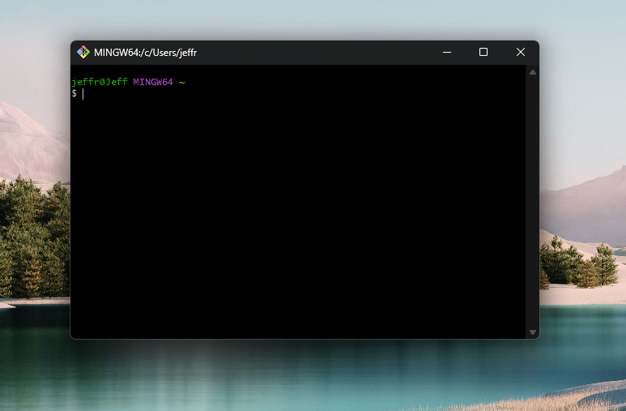
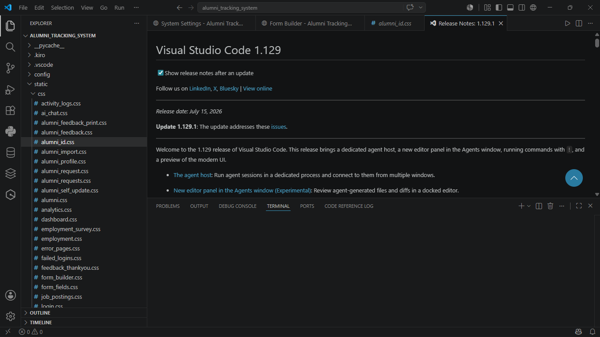
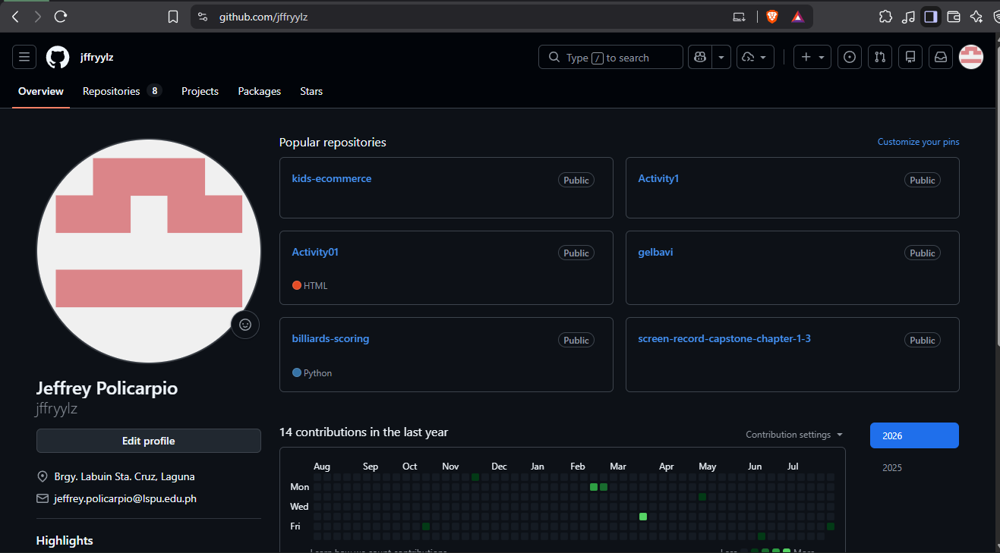
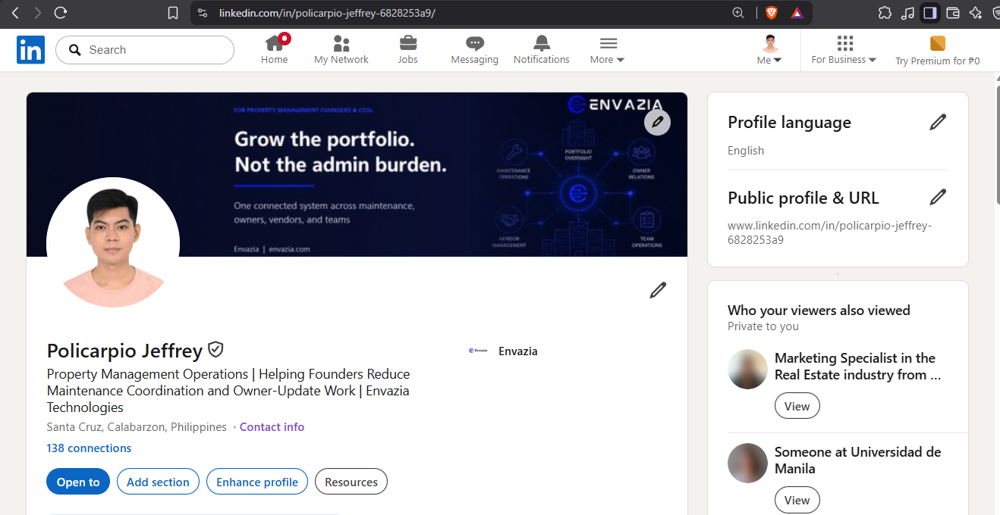

# Week 1 – Building My Professional Environment

---

## Student Information

| Field | Details |
|---|---|
| **Name** | Jeffrey D. Policarpio |
| **Student Number** | 0123-1526 |
| **Course** | Bachelor of Science in Information Technology (BSIT) |
| **Section** | BSIT B |
| **Subject** | ITEP 414 – System Administration and Maintenance |
| **Instructor** | John Peñaredondo |
| **Date** | August 7, 2026 |
| **Semester / Academic Year** | 1st Semester, AY 2026–2027 |
| **GitHub** | https://github.com/jffryylz |

---

## Objectives

By the end of this Week 1 laboratory activity, I aimed to:

1. Prepare my workstation with the tools required for system administration work.
2. Install and configure essential system administration tools including Git, GitHub Desktop, and Visual Studio Code.
3. Set up virtualization software (VirtualBox) and obtain the necessary ISO files for Ubuntu and Windows 11 Enterprise Evaluation.
4. Create and organize a GitHub portfolio repository to document my progress throughout the course.
5. Learn basic documentation using Markdown to produce clear and structured README files.
6. Create and establish professional online accounts to support my development as a future IT professional.
7. Begin building a professional technical portfolio that reflects my skills and academic work.

---

## Software Installed

The following software was installed or prepared as part of this Week 1 activity:

| Software | Purpose |
|---|---|
| **Git** | Version control system for managing code and repositories |
| **GitHub Desktop** | GUI client for interacting with GitHub repositories |
| **Visual Studio Code** | Source code editor for writing and managing files |
| **VirtualBox** | Virtualization platform for running virtual machines |
| **Ubuntu Desktop/Server ISO** | Linux operating system image for virtual machine setup |
| **Windows 11 Enterprise Evaluation ISO** | Windows OS image for virtual machine setup |

---

## Professional Accounts

The following professional accounts were created or used as part of this activity:

| Platform | URL / Details |
|---|---|
| **GitHub** | https://github.com/jffryylz |
| **LinkedIn** | https://www.linkedin.com/in/policarpio-jeffrey-6828253a9/?skipRedirect=true |

---

## Installation Screenshots

### Git

### GitHub Desktop

### Visual Studio Code

---

## Account Screenshots

### GitHub Profile

### LinkedIn Profile

---

## Challenges Encountered

### Challenge 1 – Git/GitHub Push Error

During a previous academic activity in another subject with Sir Keleb, I encountered an issue with Git and GitHub where I had difficulty pushing my local repository to GitHub. The push worked when I used the terminal, but I encountered an error when trying to perform the same action through Git directly. I was able to continue working by using the terminal to complete the push successfully.

This experience helped me better understand the distinction between Git and GitHub — Git as a local version control tool and GitHub as a remote hosting platform. It also reinforced the importance of knowing how to use Git through the command line, not just through graphical interfaces, since the terminal gave me a reliable fallback when other methods failed.

---

### Challenge 2 – Outdated Visual Studio Code Installer

During my first year, I encountered an issue when installing Visual Studio Code because the version I had downloaded was outdated. I needed to find and install a more recent version before I could use it properly.

This experience taught me the importance of always verifying software versions before installation and downloading software exclusively from official sources. Using outdated installers can lead to compatibility issues and missing features, so checking the official website for the latest release is a habit I have carried forward since then.

---

### Challenge 3 – Ubuntu Installation Experience

During my second year, I installed Ubuntu as part of a previous academic activity. The installation itself completed without any errors or issues. Although I did not end up using Ubuntu extensively after that activity, the experience was still worthwhile.

Going through the Ubuntu installation process helped me become familiar with how a Linux operating system is set up from scratch. It gave me a foundational understanding of Linux environments and the kind of preparation involved in configuring a system for use in system administration work, which is directly relevant to what we are doing in this course.

---

## Reflection

Starting Week 1 of ITEP 414 – System Administration and Maintenance was a practical and eye-opening experience. This week focused on setting up the tools and environment that are essential for a system administrator, and it gave me a clearer picture of what professional IT work actually looks like in terms of preparation and organization.

Installing Git, GitHub Desktop, and Visual Studio Code helped me understand how version control fits into everyday technical work. Git allows me to track changes in my files and collaborate on projects, while GitHub provides a platform to host and share those projects publicly. Learning to document my work using Markdown was also a valuable skill, as clear and organized documentation is something every IT professional needs to develop.

Setting up VirtualBox and preparing ISO files for Ubuntu and Windows 11 Enterprise gave me a glimpse into virtualization, which is a core concept in system administration. Being able to run multiple operating systems on a single machine is a practical skill that I expect to use throughout this course and in my future career.

Creating a GitHub portfolio repository was one of the more meaningful parts of this activity. It is not just a place to store files — it is a professional record of my progress and capabilities as a student. Maintaining it properly throughout the semester will help me build something I can actually show to future employers.

Overall, Week 1 laid the groundwork for everything that follows in this course. The tools I set up, the accounts I created, and the habits I am beginning to form — careful documentation, organized file management, and consistent use of version control — are all things that a working System Administrator relies on daily. I look forward to building on this foundation as the semester progresses.

---

## References

- Git – Official Documentation: https://git-scm.com/doc
- GitHub – Official Website: https://github.com
- GitHub Desktop – Official Website: https://desktop.github.com
- Visual Studio Code – Official Website: https://code.visualstudio.com
- VirtualBox – Official Website: https://www.virtualbox.org
- Ubuntu – Official Website: https://ubuntu.com
- Microsoft Windows 11 – Official Website: https://www.microsoft.com/en-us/windows/windows-11
- LinkedIn – Official Website: https://www.linkedin.com
