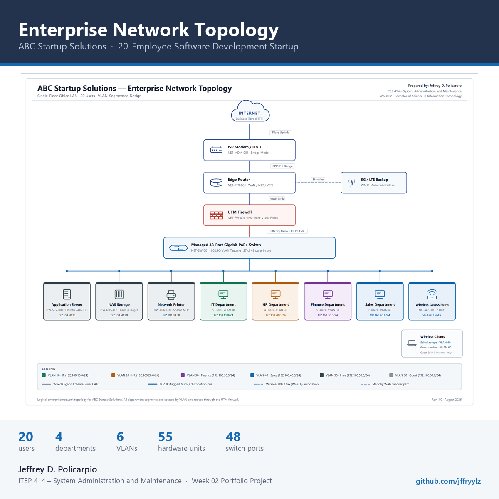

# LinkedIn Post — Week 02

---

Week 2 of ITEP 414 – System Administration and Maintenance is done, and this one was a big step up from installing tools.

The task was to plan a complete enterprise IT infrastructure from scratch for ABC Startup Solutions, a fictional 20-employee software development startup with one office floor and — literally — nothing. No computers, no server, no network, no internet service, no security policies.

What I designed:

• A full hardware inventory of 55 units, with quantities I had to justify rather than just issuing one device per employee
• A software inventory covering the standard build, including the licensing conditions attached to each product
• A network inventory and a VLAN-segmented network design separating IT, HR, Finance, Sales, infrastructure and guest traffic
• A network topology diagram covering the full path from the internet through the ISP modem, router, firewall and managed switch down to every department
• Infrastructure recommendations for internet service, server specification, a 3-2-1 backup strategy, security controls, antivirus, password policy and a staged expansion plan

The most useful lesson was that good infrastructure planning is mostly about what you decide NOT to build. My first draft had a second server in it for redundancy. Once I worked out that email, identity and file collaboration would already live in Microsoft 365, that second server was doubling the cost to protect the least critical systems. It came out.

I also had to correct myself on something I thought I understood. I assumed putting each department on its own VLAN was the security control. It isn't — VLANs separate broadcast domains, and the actual protection comes from terminating those VLANs on the firewall so traffic between departments has to pass a policy. That changed both my design and my diagram.

Skills I practised: infrastructure planning, network design and segmentation, hardware/software/network inventory management, technical documentation, and researching from official vendor sources instead of working from memory. That last one caught a real error — the AWS certification I planned to cite has been renamed to AWS Certified CloudOps Engineer – Associate.

Everything is documented in my portfolio repository, including the report, the network diagram and the editable Draw.io source file.

🔗 https://github.com/jffryylz/BSIT-SystemAdministration-Portfolio

Still a student, still learning in public. On to Week 3.

#SystemAdministration #InfrastructurePlanning #Networking #GitHub #BSIT #LearningInPublic #ITInfrastructure #NetworkDesign #TechnicalDocumentation #StudentPortfolio
