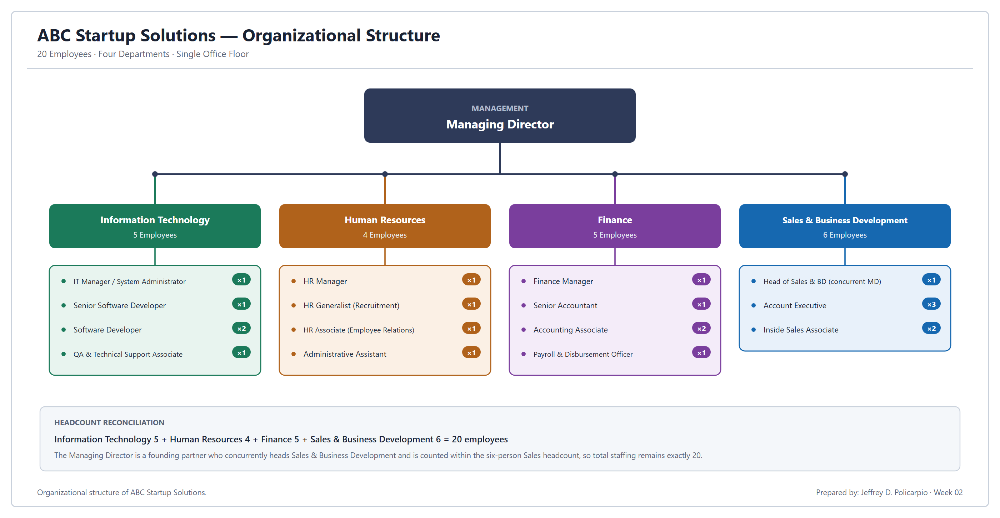
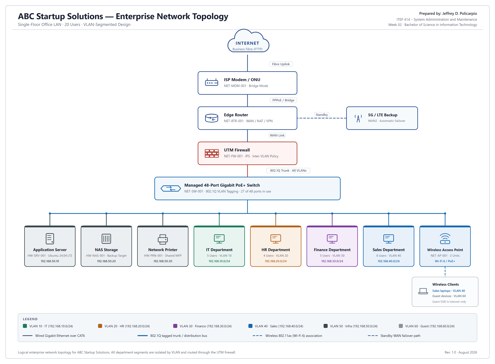

# Week 02 — Enterprise Infrastructure Planning

Designing a complete enterprise IT infrastructure from scratch for **ABC Startup Solutions**, a fictional 20-employee software development startup with no existing computers, server, network, internet service or security policies.

---

## Student Information

| Field | Details |
|---|---|
| **Name** | Jeffrey D. Policarpio |
| **Student Number** | 0123-1526 |
| **Course** | Bachelor of Science in Information Technology (BSIT) |
| **Section** | BSIT B |
| **Subject** | ITEP 414 – System Administration and Maintenance |
| **Instructor** | John Peñaredondo |
| **Date** | August 14, 2026 |
| **Semester / Academic Year** | 1st Semester, AY 2026–2027 |
| **GitHub** | https://github.com/jffryylz |

---

## Project Overview

| Item | Details |
|---|---|
| **Project Status** | Completed |
| **Course** | ITEP 414 – System Administration and Maintenance |
| **Program** | Bachelor of Science in Information Technology (BSIT) |
| **Project Type** | Individual Portfolio Project |
| **Scenario** | ABC Startup Solutions — 20-employee software development startup, single office floor, no existing IT infrastructure |
| **Deliverable Format** | PDF report, network diagram (PNG / PDF / Draw.io), Markdown documentation |

### Key Deliverables

| Deliverable | File |
|---|---|
| Full infrastructure plan (30-page report) | [EnterpriseInfrastructurePlan.pdf](EnterpriseInfrastructurePlan.pdf) |
| Network topology — image | [diagrams/EnterpriseNetworkTopology.png](diagrams/EnterpriseNetworkTopology.png) |
| Network topology — print/vector | [diagrams/EnterpriseNetworkTopology.pdf](diagrams/EnterpriseNetworkTopology.pdf) |
| Network topology — editable source | [diagrams/EnterpriseNetworkTopology.drawio](diagrams/EnterpriseNetworkTopology.drawio) |
| Organisational structure chart | [images/OrganizationalStructure.png](images/OrganizationalStructure.png) |
| Source list | [references/references.md](references/references.md) |
| LinkedIn portfolio post | [LinkedInPost.md](LinkedInPost.md) |

[**View the full Enterprise Infrastructure Plan (PDF)**](EnterpriseInfrastructurePlan.pdf)

---

## Learning Objectives

By completing this Week 2 portfolio project, I aimed to:

1. Analyse a business scenario and translate organisational structure into concrete IT infrastructure requirements.
2. Plan a complete enterprise hardware inventory with justified quantities rather than one device per employee.
3. Build a software inventory and understand the licensing conditions attached to each product, including the ones that are free for personal use but not for business use.
4. Design a network inventory and a segmented network architecture appropriate to a single-floor, 20-user office.
5. Produce a professional network topology diagram using standard networking symbols and a Draw.io-compatible source file.
6. Research four system administration career roles using official vendor and certification sources, and explain how the roles work together.
7. Recommend practical infrastructure decisions covering internet service, server specification, backup, security, antivirus, password policy and expansion.
8. Practise professional technical documentation and version control as a portfolio artifact.

---

## Company Scenario

**ABC Startup Solutions** is a newly established software development company. At the start of this project the company has **20 employees**, **one office floor**, and none of the following: computers, a server, a network, internet infrastructure, or security policies. The entire infrastructure had to be designed from scratch.

| Department | Employees |
|---|---:|
| Information Technology | 5 |
| Human Resources | 4 |
| Finance | 5 |
| Sales & Business Development | 6 |
| **Total** | **20** |

**Nature of business.** ABC Startup Solutions is a newly established software development company that designs, builds and maintains custom web and mobile applications for small and medium enterprises in the Philippines. Alongside project delivery, the company provides post-deployment application support and light IT consulting to its clients. Because it is a services business, its most valuable assets are its people, its source code and the client data entrusted to it — all three depend directly on the reliability and security of the internal infrastructure planned in this document.

**Office location.** Unit 3A, Meridian Corporate Centre, 128 Pioneer Business Park, Barangay San Antonio, Santa Cruz, Laguna 4009, Philippines

### Organisational Structure



*The company runs a flat, two-level structure appropriate to its size. A Managing Director provides overall direction, and four department heads report directly to that role. The Managing Director is a founding partner who concurrently heads Sales & Business Development and is counted within the six-person Sales headcount, so total staffing remains exactly 20.*

---

## Hardware Inventory Summary

Quantities were derived from role requirements and a counted port and device budget, not from headcount alone. The complete inventory, including the selection rationale for each decision, is in **Part 2** of the [PDF report](EnterpriseInfrastructurePlan.pdf).

| Asset ID | Hardware | Qty | Department / Location |
|---|---|---:|---|
| HW-PC-001 | Desktop Computer (business tower) | 15 | IT 4 · HR 4 · Finance 5 · Sales 2 |
| HW-LAP-001 | Business Laptop (14") | 6 | IT 1 · Sales 4 · Spare 1 |
| HW-MON-001 | 24" IPS Monitor (1920×1080) | 19 | All departments |
| HW-SRV-001 | Tower/Rack Server (virtualisation host) | 1 | IT · Server cabinet |
| HW-NAS-001 | 4-Bay NAS, 4 × 4 TB (RAID 5, ≈12 TB usable) | 1 | IT · Server cabinet |
| HW-BKP-001 | 8 TB External USB Backup Drive | 2 | IT · One on site, one off site |
| HW-PRN-001 | A4 Colour Laser Multifunction Printer | 1 | Shared · Open work area |
| HW-UPS-001 | 3 kVA Rack-Mount Line-Interactive UPS | 1 | IT · Server cabinet |
| HW-UPS-002 | 1 kVA Desktop UPS | 5 | Finance |
| NET-RTR-001 | Business Edge Router (dual WAN) | 1 | IT · Server cabinet |
| NET-SW-001 | 48-Port Managed Gigabit PoE+ Switch | 1 | IT · Server cabinet |
| NET-AP-001 | Wireless Access Point, Wi-Fi 6 (802.11ax), PoE+ | 2 | Open work area · Meeting room |

**Total: 55 units across 12 asset classes.**

Selected decisions worth noting:

- **21 endpoints for 20 staff** — 15 desktops for fixed-desk roles, 5 assigned laptops where mobility is genuinely required, and 1 unassigned spare so a hardware failure does not idle an employee during warranty repair.
- **19 monitors, not 20** — one per desktop, second screens for the three developers, and one for the IT Manager's docked laptop. The spare laptop has its own display.
- **One server, not two** — email, identity and file collaboration live in Microsoft 365, so a second host would have doubled cost to protect the least critical workloads. Resilience comes from the backup strategy instead.
- **UPS units only where the risk justifies them** — the server cabinet and the five Finance workstations. The laser printer is deliberately excluded, because its fuser draws an inrush current that can overload a UPS.

---

## Software Inventory Summary

Versions are stated only where a specific release was verified; elsewhere the standard is the current supported release. Licensing conditions are covered in **Part 3** of the [PDF report](EnterpriseInfrastructurePlan.pdf).

| Software | Version | Licence | Purpose |
|---|---|---|---|
| Windows 11 Pro | Current supported release | OEM, per device | Standard desktop and laptop operating system. |
| Ubuntu Server LTS | 24.04 LTS (Noble Numbat) | Free and open source | Operating system for the single virtualisation host, running KVM/libvirt. |
| Microsoft 365 Business Premium (includes Microsoft Office) | Current supported release | Subscription, 20 seats | Supplies the Microsoft Office applications, Exchange email, OneDrive and SharePoint, and Teams. |
| Visual Studio Code | Latest stable release | Free (proprietary licence) | Primary code editor for the development team, with extensions for the project languages, linting and remote container development. |
| Git | Latest stable release | Free and open source (GPLv2) | Distributed version control underpinning all client project work, code review and release history. |
| GitHub Desktop | Latest stable release | Free and open source (MIT) | Graphical Git client for staff who are not comfortable at the command line, particularly QA and junior developers reviewing branches. |
| Oracle VirtualBox | Latest stable 7.x release | Base package free (GPLv3) | Local virtual machines for developers testing against clean Windows and Linux targets. |
| Google Chrome | Latest stable release | Free (proprietary licence) | Standard browser for web application testing and access to cloud services, centrally configured using the Chrome Enterprise policy templates. |
| Microsoft Defender Antivirus | Built in, evergreen | Included with Windows 11 Pro | Endpoint anti-malware on every Windows device, centrally monitored and policy-managed through Microsoft Defender for Business. |
| AnyDesk | Latest stable release | Commercial licence required | Remote support tool allowing the IT Manager to assist staff without leaving the desk and to reach machines used off site. |
| 7-Zip | Latest stable release | Free and open source (GNU LGPL) | Archive creation and extraction, including AES-256 encrypted archives used when files must be handed to a client outside the normal channels. |
| Bitwarden (Teams) | Latest stable release | Subscription, per user | Company password manager. |
| Veeam Backup & Replication Community Edition | Latest stable release | Free tier, up to 10 workloads | Backs up the server's virtual machines to the NAS and to the rotating external drives. |

**Two licensing conditions that are easy to miss:**

- The **VirtualBox base package** is GPL-licensed and free for commercial use, but the **Extension Pack** is a separate product under Oracle's Personal Use and Evaluation Licence and is **not** free for business use.
- The **AnyDesk free version is licensed for personal use only**; commercial use requires a paid licence, so one is budgeted for the IT Manager.

---

## Network Inventory Summary

| Asset ID | Network Equipment | Qty | Location |
|---|---|---:|---|
| NET-MDM-001 | ISP Fibre Modem / ONU | 1 | Server cabinet |
| NET-RTR-001 | Business Edge Router (dual WAN) | 1 | Server cabinet |
| NET-FW-001 | UTM Firewall Appliance | 1 | Server cabinet |
| NET-SW-001 | 48-Port Managed Gigabit PoE+ Switch | 1 | Server cabinet |
| NET-AP-001 | Wireless Access Point, Wi-Fi 6 (802.11ax), PoE+ | 2 | Ceiling: open work area, meeting room |
| NET-PP-001 | 24-Port CAT6 Patch Panel | 2 | Server cabinet |
| NET-CBL-001 | CAT6 U/UTP Solid Cable, 305 m box | 3 | Structured cabling, floor-wide |
| NET-CBL-002 | CAT6 Stranded Patch Cords (1 m / 2 m) | 40 | Server cabinet and workstations |
| NET-RJ45-001 | CAT6 RJ45 Connectors (shielded, box) | 200 | IT stock |

### Why a 48-Port Switch for 20 People

The switch was sized by counting connections, not employees:

| Connected Device | Ports |
|---|---:|
| Employee desk drops (one per workstation) | 20 |
| Application server (two bonded NICs) | 2 |
| NAS storage | 1 |
| Network printer / MFP | 1 |
| Wireless access points (PoE+) | 2 |
| Tagged trunk uplink to the UTM firewall | 1 |
| Total in use at go-live | 27 |
| Spare capacity for growth | 21 |
| Installed capacity | 48 |

A 24-port switch would have been fully consumed on day one with three devices left unplugged. At 27 of 48 ports the design has room to grow to roughly 35 staff without replacing any core equipment.

### Structured Cabling

Of the 27 live ports, four are patched inside the cabinet and need no horizontal cable run: the two bonded server NICs, the NAS, and the trunk uplink to the firewall. That leaves **23 active horizontal runs** — 20 desk drops, 2 access points and 1 printer.

**Approximately 26 horizontal runs are planned:** the 23 active drops plus **3 spare drops** reserved for the meeting room and reception during the initial fit-out. At an average of roughly 25 m per run this is about 650 m of horizontal cable; three 305 m boxes supply roughly 915 m, covering routing detours, service loops, terminations and waste. The spare drops cost almost nothing while the ceiling is already open, and they avoid disruptive cable work when the office grows.

### VLAN Segmentation Plan

| VLAN | Name | Subnet | Assigned To |
|---:|---|---|---|
| 10 | IT | 192.168.10.0/24 | IT Department (5 users) |
| 20 | HR | 192.168.20.0/24 | Human Resources (4 users) |
| 30 | Finance | 192.168.30.0/24 | Finance (5 users) |
| 40 | Sales | 192.168.40.0/24 | Sales & BD (6 users), corporate Wi-Fi |
| 50 | Servers & Infrastructure | 192.168.50.0/24 | Server, NAS, printer, management interfaces |
| 60 | Guest Wi-Fi | 192.168.60.0/24 | Visitor devices |

VLANs on their own only separate broadcast domains. The security control is that **every VLAN interface terminates on the UTM firewall**, so traffic between departments has no path except through a written policy that can be filtered and logged.

---

## Enterprise Network Diagram



*Logical enterprise network topology for ABC Startup Solutions. All department segments are isolated by VLAN and routed through the UTM firewall.*

| Format | File | Use |
|---|---|---|
| PNG | [EnterpriseNetworkTopology.png](diagrams/EnterpriseNetworkTopology.png) | 3200 × 2360 raster, embedded above |
| PDF | [EnterpriseNetworkTopology.pdf](diagrams/EnterpriseNetworkTopology.pdf) | A3 vector, for printing |
| Draw.io | [EnterpriseNetworkTopology.drawio](diagrams/EnterpriseNetworkTopology.drawio) | Editable source, opens in diagrams.net |
| SVG | [EnterpriseNetworkTopology.svg](diagrams/EnterpriseNetworkTopology.svg) | Vector master used to produce the PNG and PDF |

The diagram includes every component required by the scenario — Internet, ISP modem, router, firewall, switch, wireless access point, server, printer and all four department segments — plus the NAS and the standby WAN failover path.

---

## Technologies Used

### Tools used to produce this deliverable

| Tool | Purpose |
|---|---|
| Draw.io / diagrams.net | Editable network topology source file |
| Markdown | Repository documentation |
| Git and GitHub | Version control and portfolio hosting |
| Visual Studio Code | Writing documentation and diagram source |
| PDF | Formal report deliverable |

### Technologies specified in the infrastructure design

| Area | Technology |
|---|---|
| Client operating system | Windows 11 Pro |
| Server operating system | Ubuntu Server 24.04 LTS with KVM / libvirt |
| Productivity, identity and endpoint management | Microsoft 365 Business Premium (Entra ID P1, Intune, Defender for Business) |
| Network segmentation | 802.1Q VLANs with firewall-enforced inter-VLAN policy |
| Wireless | Wi-Fi 6 (802.11ax), WPA3, isolated guest SSID |
| Structured cabling | CAT6 U/UTP, 24-port patch panels, keystone terminations |
| Storage and backup | NAS RAID 5, RAID 10 server storage, 3-2-1 backup strategy |
| Security | UTM firewall with IPS, BitLocker and LUKS encryption, MFA |
| Development | Git, Visual Studio Code, VirtualBox, Docker |

---

## Challenges Encountered

### Challenge 1 — Deciding how much infrastructure is actually enough

My first draft of the hardware list was noticeably larger than the final one, because adding equipment felt like it made the design look more professional. Going back through it and asking what problem each item actually solved removed several things, including a second server I had added for redundancy. Once I worked out that email, identity and files would already be in Microsoft 365, the second server was doubling the cost to protect the least critical workloads. Learning to justify a removal was harder than justifying a purchase.

### Challenge 2 — Understanding what VLANs actually protect

I initially believed that putting each department on its own VLAN was itself the security control. Reading further, I understood that VLANs separate broadcast domains but say nothing about who can reach what — the actual protection comes from terminating the VLAN interfaces on the firewall so that inter-department traffic must pass a policy. I had to revise both the design and the diagram after realising this, and it changed how I described the firewall's role in the report.

### Challenge 3 — Producing a diagram at a professional standard

Getting the topology to read clearly took several attempts. The problems were practical ones: keeping the hierarchy obvious from top to bottom, avoiding crossing lines, keeping labels legible at a readable size, and separating infrastructure from department endpoints visually. Laying the eight branches out along a single distribution bus, in a deliberate left-to-right order, was what finally removed every line crossing.

### Challenge 4 — Verifying facts instead of assuming them

Checking sources against official pages rather than writing from memory caught real errors. The AWS certification I intended to cite has been renamed — **AWS Certified SysOps Administrator – Associate** is now **AWS Certified CloudOps Engineer – Associate (SOA-C03)**. I also found that the VirtualBox Extension Pack and the free version of AnyDesk both carry licensing conditions that would make them non-compliant in a real business. Neither would have been obvious without going to the vendor's own documentation.

---

## Reflection

Before this project I thought of IT infrastructure mostly as a list of equipment. If someone had asked me what a 20-person company needs, I would have answered with hardware — twenty computers, a server, a router — and considered the question answered. Working through this plan changed that. The equipment was the easy part. The difficult part was justifying every decision against the actual company: its size, its budget, the data it handles, and the fact that it can afford only one person to run everything.

The most valuable thing I learned is that good infrastructure decisions are mostly decisions about what not to build. My first draft included more than the company needed, because adding equipment felt like it made the design look more professional. When I went back and asked what each item actually solved, several came out. I had included a second server for redundancy before realising that the company's critical systems — email, files, identity — would already be in Microsoft 365, so the second server would have doubled the cost to protect the least critical workloads.

The most challenging task was the network design, specifically deciding whether to use VLANs. Segmentation is more work to configure and troubleshoot, and for one floor of twenty people a flat network would have worked. What convinced me was the Finance and HR data — payroll records and employment contracts sitting on the same flat network as everyone else. I also had to correct myself partway through: I thought putting departments on separate VLANs was itself the security control, and only later understood that VLANs separate broadcast domains, and that the real protection comes from forcing the traffic between them through the firewall. Getting the diagram to show that clearly took several attempts.

Planning before deployment stopped being an abstract idea. Almost every decision constrains a later one. A 24-port switch looked reasonable until I counted the ports properly and found 27 connections on day one. Cabling is even less forgiving, because running it is disruptive and expensive and cannot be corrected with a configuration change. Deciding these things on paper costs an afternoon; discovering them after installation costs money.

As a student aiming for a career in system administration, the habit I most want to carry forward is writing down the reason for a decision, not just the decision. Writing the collaboration section made me realise how much of this work is handing information to someone else — a colleague, or my own future self trying to remember why a firewall rule exists. I have no professional experience yet and this plan has not been deployed, but it is the first time I have had to defend a complete technical design from end to end.

---

## References

The full categorised source list is in [references/references.md](references/references.md). Key sources include:

- [CompTIA A+ Certification](https://www.comptia.org/en-us/certifications/a/)
- [Cisco CCNA Certification](https://www.cisco.com/site/us/en/learn/training-certifications/certifications/enterprise/ccna/index.html)
- [Red Hat Certified System Administrator (RHCSA)](https://www.redhat.com/en/services/certification/rhcsa)
- [AWS Certified CloudOps Engineer – Associate](https://aws.amazon.com/certification/certified-cloudops-engineer-associate/)
- [Microsoft Certified: Azure Administrator Associate (AZ-104)](https://learn.microsoft.com/en-us/credentials/certifications/azure-administrator/)
- [Google Cloud — Associate Cloud Engineer](https://cloud.google.com/learn/certification/cloud-engineer)
- [NIST SP 800-63B — Digital Identity Guidelines](https://pages.nist.gov/800-63-4/sp800-63b.html)
- [Republic Act 10173 — Data Privacy Act of 2012](https://privacy.gov.ph/data-privacy-act/)
- [Ubuntu Server](https://ubuntu.com/server)
- [Oracle VirtualBox — Licensing FAQ](https://www.virtualbox.org/wiki/Licensing_FAQ)

---

## Repository Structure

```text
Week02/
├── EnterpriseInfrastructurePlan.pdf     Full 30-page report
├── README.md                            This document
├── LinkedInPost.md                      LinkedIn portfolio post
├── diagrams/
│   ├── EnterpriseNetworkTopology.drawio Editable Draw.io source
│   ├── EnterpriseNetworkTopology.png    Raster export (3200 × 2360)
│   ├── EnterpriseNetworkTopology.pdf    Vector export (A3)
│   └── EnterpriseNetworkTopology.svg    Vector master
├── images/
│   ├── OrganizationalStructure.png      Organisational chart
│   └── OrganizationalStructure.svg      Vector master
└── references/
    └── references.md                    Categorised source list
```

---

> ABC Startup Solutions is a fictional company created for this academic project. The company profile, office address, staffing and asset records in this document are illustrative. No equipment has been purchased, no service provider has been engaged, and no part of this design has been deployed.
